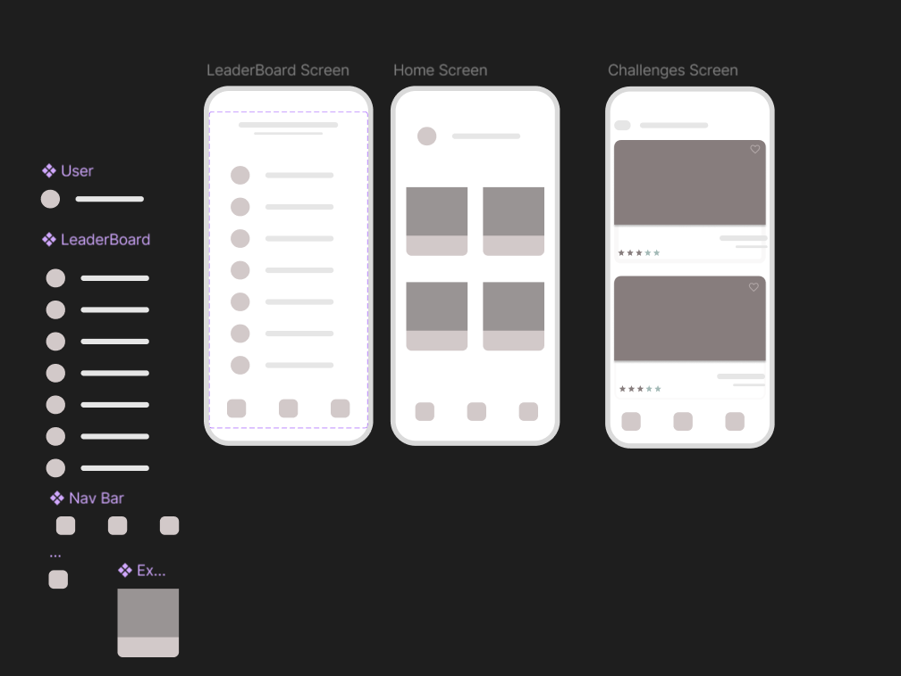
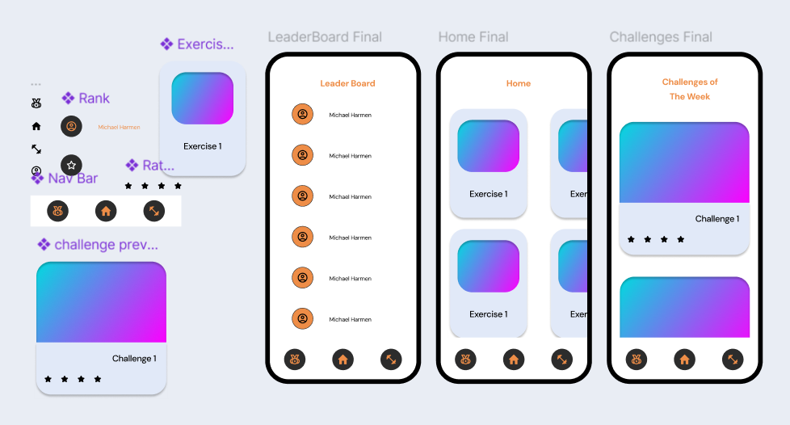

# Project Proposal

[Research](https://www.notion.so/Research-13e2b69a342c80c4b609da0aca602ecc?pvs=21)

## Name: FitQuest

### **Project Purpose and Objectives**

- The primary goal of FitQuest is to make exercising fun and engaging through gamification. Users can track their physical activity, compete with friends or nearby users, and earn points, badges, and rewards. The app aims to motivate users to maintain a healthy lifestyle by turning workouts into an interactive game.

### **Main Features**

- **Gamified Exercise Tracking**: Users earn points for daily activities like walking, running, or working out.
- **Leaderboards and Challenges**: Compete with friends or local users on daily/weekly leaderboards. Participate in custom or public challenges.
- **Social Interaction**: Connect with friends, view their progress, and send workout challenges.
- **Progress Tracking**: Detailed stats with weekly/monthly performance insights.

### **Target Audience**

- Fitness enthusiasts who enjoy competitive motivation.
- Casual users looking to stay active with friends.
- Gamers interested in integrating fitness with gameplay.

---

### **Technical Specifications**

### 1. **Tech Stack**

- **Frontend**: Kotlin with Jetpack Compose for UI.
- **Backend**: Firebase (Firestore, Authentication, Cloud Functions).
- **APIs**: [Health Connect](https://developer.android.com/health-and-fitness/guides/health-connect/plan/data-types).
    - to tracks steps: https://developer.android.com/health-and-fitness/guides/basic-fitness-app/read-step-count-data
- **Offline Support**: Room for local data storage.
- **Background Tasks**: WorkManager for periodic data syncing and reminders.

### 2. **External Libraries/Tools**

- **Retrofit**: For networking.
- **Firebase Crashlytics**: For real-time error logging.
- **Coil**: For image loading (e.g., profile pictures).

### 3. **Data Flow**

- Fitness data is fetched from the Google Fit API and synced to Firebase Firestore.
- Room handles offline data storage and caching.
- Leaderboards and challenges are dynamically updated in real-time.

### Wireframe

### Mockup

### User Flow

1. **Home Screen**:
    - After account creation, users land on the home screen, featuring a curated list of **recommended exercises**.
    - Each exercise displays:
        - **Name**
        - **Thumbnail** or **animated preview** demonstrating the proper form.
    - Users can tap on an exercise to view detailed instructions, benefits, and muscle groups targeted.
2. **Challenges Tab**:
    - Users can explore various **fitness challenges** designed to make workouts engaging.
    - Examples of challenges include:
        - **Run 5 miles in 3 days**
        - **Complete 50 push-ups daily for a week**
    - **Battle Mode**:
        - Users can invite friends to compete in specific challenges.
        - The app tracks progress and performance metrics (e.g., speed, form, or consistency) to determine who "won" the challenge.
3. **Leaderboard**:
    - Tracks and displays top performers globally or among friends.
    - Users can filter leaderboards by specific metrics:
        - **Most miles walked/ran**
        - **Most challenges completed**
        - **Best performance in head-to-head battles**
